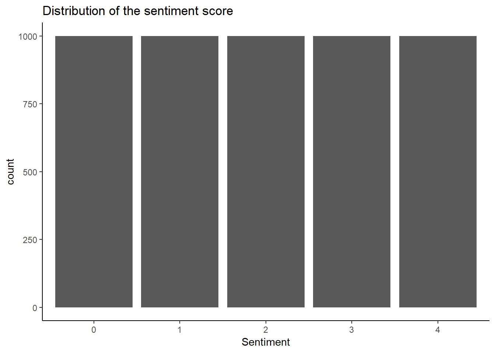
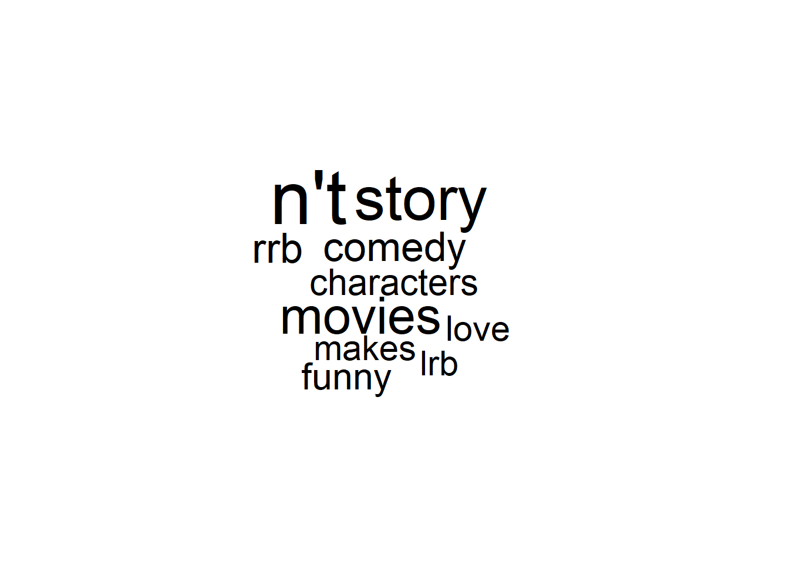
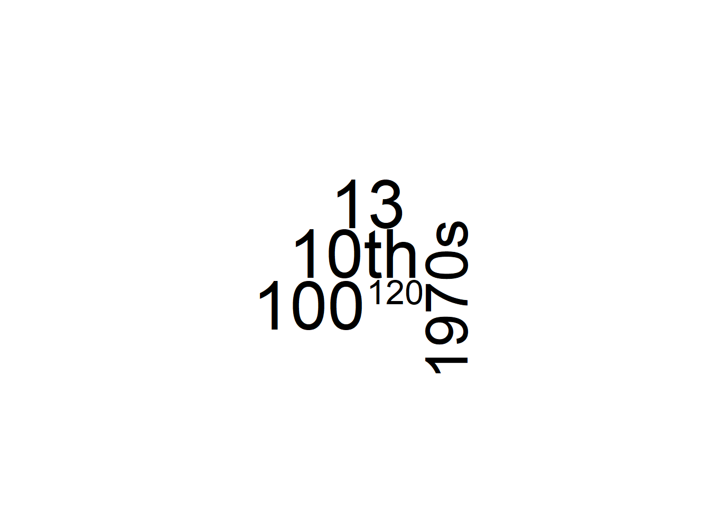
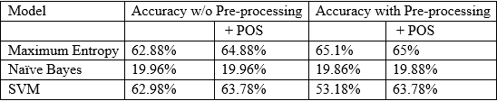

```{r setup, include=FALSE}
knitr::opts_chunk$set(echo = TRUE)
```

## Libraries
```{r}
set.seed(1234)
library(tidyverse)
library(tidytext)
library(ggplot2)
library(wordcloud)
library(tm)
library(e1071)
library(caret)
library(maxent)
```

## loading datasets
```{r}
train<-read_tsv("C:/Users/james/OneDrive/Ryerson/Capstone/all/train.tsv")
sentiment0<-train[which(train$Sentiment==0),][1:1000,]
sentiment1<-train[which(train$Sentiment==1),][1:1000,]
sentiment2<-train[which(train$Sentiment==2),][1:1000,]
sentiment3<-train[which(train$Sentiment==3),][1:1000,]
sentiment4<-train[which(train$Sentiment==4),][1:1000,]
train<-rbind(sentiment0,sentiment1,sentiment2,sentiment3,sentiment4)
train$Sentiment<-factor(train$Sentiment)
```

## view and exam both datasets
```{r}
glimpse(train)
length(unique(train$PhraseId))
```

## Missing values
```{r}
apply(train, 2, function(x) sum(is.na(x)))
```

We examed the dataset and found 1 missing value. It is not recommended to remove it as it would lose the prediction power.

## Distribution of the sentiment score
```{r}
ggplot(train,aes(x=Sentiment))+
  geom_bar() +
  ggtitle("Distribution of the sentiment score") +
  theme_classic()
```



## Average # of phrase and word count of a sentence
```{r}
train_addition<-train %>%
  mutate(length = str_length(Phrase),
         ncap = str_count(Phrase, "[A-Z]"),
         npunct = str_count(Phrase, "[[:punct:]]"),
         nword = str_count(Phrase, "\\w+"),
         nsymb = str_count(Phrase, "&|@|#|\\$|%|\\*|\\^"))

apply(train_addition[,c(5:9)],2, function(x) mean(x,na.rm = TRUE))

train %>%
  group_by(SentenceId) %>%
  summarise(n=n()) %>%
  summarise(mean=mean(n))
```


## Top & Bottom 10 common words in train.
```{r}
topten_commonwords = function(train)
{
    train %>%
    unnest_tokens(word,Phrase) %>%
    filter(!word %in% c(stop_words$word,"movie","film"))%>%
    count(word,sort=TRUE)%>%
    head(10) %>%
    with(wordcloud(word,n ,max.words = 10, main="Top 10 common words"))}

topten_commonwords(train)
```


```{r}
Bottomten_commonwords = function(train)
{
    train %>%
    unnest_tokens(word,Phrase) %>%
    filter(!word %in% c(stop_words$word,"movie","film"))%>%
    count(word,sort=FALSE)%>%
    head(10) %>%
    with(wordcloud(word,n ,max.words = 10, main="Bottom 10 common words"))}

Bottomten_commonwords(train)
```


# Converting to Matrix without pre-processing
```{r}
train_corpus<-Corpus(VectorSource(train$Phrase))

train_dtm<-DocumentTermMatrix(train_corpus)
train_sparse<-as.compressed.matrix(train_dtm)
train_remove<-removeSparseTerms(train_dtm,sparse = 0.999)
train_m<-as.data.frame(as.matrix(train_remove))
```

# Converting to Matrix with pre-processing
```{r}
train_corpus<-Corpus(VectorSource(train$Phrase))

clean_corpus <- function(x){
  x <- tm_map(x, stripWhitespace)
  x <- tm_map(x, removePunctuation)
  x <- tm_map(x, content_transformer(tolower))
  x <- tm_map(x, removeWords, stopwords("en"))
  return(x)
}
train_corpus_cleaned<-clean_corpus(train_corpus)
train_dtm_cleaned<-DocumentTermMatrix(train_corpus_cleaned)
train_sparse_cleaned<-as.compressed.matrix(train_dtm_cleaned)
train_remove_cleaned<-removeSparseTerms(train_dtm_cleaned,sparse = 0.999)
train_m_cleaned<-as.data.frame(as.matrix(train_remove_cleaned))
```


# Training data without pre-processing & 10-fold cross validation
```{r}
n<-nrow(train_sparse_cleaned)
K<-10
segment<-n%/%K
alea<-runif(n)
rang<-rank(alea)
regrouped<-(rang-1)%/%segment + 1
regrouped<-as.factor(regrouped)

accuracy<-numeric(0)
for (k in 1:K) {
  model_maxent<-maxent(train_sparse[regrouped!=k],as.factor(train$Sentiment[regrouped!=k]))
  pred<-predict(model_maxent,train_sparse[regrouped==k])
  cm<-confusionMatrix(table(train$Sentiment[regrouped==k],pred[,1]))
  accuracy<-rbind(cm$overall[1],accuracy)
}

accuracy.cv<-mean(accuracy)
accuracy.cv

#Naive Bayes
accuracy_nb<-numeric(0)
for (k in 1:K) {
  model_nb <- naiveBayes(train_m[regrouped!=k,],train$Sentiment[regrouped!=k])
  pred_nb<-predict(model_nb,train_m[regrouped==k,])
  cm_nb<-confusionMatrix(table(train$Sentiment[regrouped==k],pred_nb))
  accuracy_nb<-rbind(cm$overall[1],accuracy_nb)
}
accuracy.cv_nb<-mean(accuracy_nb)
accuracy.cv_nb

#SVM
accuracy_svm<-numeric(0)
for (k in 1:K) {
  model_svm <- svm(train_m[regrouped!=k,],train$Sentiment[regrouped!=k])
  pred_svm<-predict(model_svm,train_m[regrouped==k,])
  cm_svm<-confusionMatrix(table(train$Sentiment[regrouped==k],pred_svm))
  accuracy_svm<-rbind(cm$overall[1],accuracy_svm)
}
accuracy.cv_svm<-mean(accuracy_svm)
accuracy.cv_svm
```

# Training data with pre-processing & 10-fold cross validation
```{r}
n<-nrow(train_sparse)
K<-10
segment<-n%/%K
alea<-runif(n)
rang<-rank(alea)
regrouped<-(rang-1)%/%segment + 1
regrouped<-as.factor(regrouped)

accuracy<-numeric(0)
for (k in 1:K) {
  model_maxent<-maxent(train_sparse_cleaned[regrouped!=k],as.factor(train$Sentiment[regrouped!=k]))
  pred<-predict(model_maxent,train_sparse_cleaned[regrouped==k])
  cm<-confusionMatrix(table(train$Sentiment[regrouped==k],pred[,1]))
  accuracy<-rbind(cm$overall[1],accuracy)
}

accuracy.cv<-mean(accuracy)
accuracy.cv

#Naive Bayes
accuracy_nb<-numeric(0)
for (k in 1:K) {
  model_nb <- naiveBayes(train_m_cleaned[regrouped!=k,],train$Sentiment[regrouped!=k])
  pred_nb<-predict(model_nb,train_m_cleaned[regrouped==k,])
  cm_nb<-confusionMatrix(table(train$Sentiment[regrouped==k],pred_nb))
  accuracy_nb<-rbind(cm$overall[1],accuracy_nb)
}
accuracy.cv_nb<-mean(accuracy_nb)
accuracy.cv_nb

#SVM
accuracy_svm<-numeric(0)
for (k in 1:K) {
  model_svm <- svm(train_m_cleaned[regrouped!=k,],train$Sentiment[regrouped!=k])
  pred_svm<-predict(model_svm,train_m_cleaned[regrouped==k,])
  cm_svm<-confusionMatrix(table(train$Sentiment[regrouped==k],pred_svm))
  accuracy_svm<-rbind(cm$overall[1],accuracy_svm)
}
accuracy.cv_svm<-mean(accuracy_svm)
accuracy.cv_svm
```

