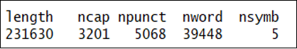
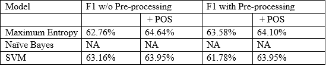

```{r setup, include=FALSE}
knitr::opts_chunk$set(echo = TRUE)
```

## Libraries
```{r}
set.seed(1234)
library(tidyverse)
library(tidytext)
library(ggplot2)
library(wordcloud)
library(tm)
library(e1071)
library(caret)
library(maxent)
```

## Loading datasets
```{r}
train<-read_tsv("C:/Users/james/OneDrive/Ryerson/Capstone/dataset/train.tsv")
sentiment0<-train[which(train$Sentiment==0),][1:1000,]
sentiment1<-train[which(train$Sentiment==1),][1:1000,]
sentiment2<-train[which(train$Sentiment==2),][1:1000,]
sentiment3<-train[which(train$Sentiment==3),][1:1000,]
sentiment4<-train[which(train$Sentiment==4),][1:1000,]
train<-rbind(sentiment0,sentiment1,sentiment2,sentiment3,sentiment4)
train$Sentiment<-factor(train$Sentiment)
```


# Adding POS Tagging to the dataset
```{r}
word<-train %>%
  unnest_tokens(word,Phrase) %>%
  left_join(parts_of_speech[!duplicated(parts_of_speech$word),])

tb<-as.data.frame.matrix(table(word$PhraseId,word$pos))
tb$PhraseId<-rownames(tb)

train_final <- merge(train, tb, by="PhraseId",all.x = TRUE)
train_final[is.na(train_final)]<-0
```

## View and exam the dataset
```{r}
glimpse(train_final)
length(unique(train_final$PhraseId))
```

## Missing values
```{r}
apply(train_final, 2, function(x) sum(is.na(x)))
```

We found 0 missing phrase so this is good to proceed.

## Distribution of the sentiment score
```{r}
ggplot(train_final,aes(x=Sentiment))+
  geom_bar() +
  ggtitle("Distribution of the sentiment score") +
  theme_classic()
```

We can see that the dataset was well balanced and each score was evenly assigned with 1000 phrases. It will be great to use in our classification models in the later steps.


## Average # of phrase and word count of a sentence
```{r}
train_addition<-train_final %>%
  mutate(length = str_length(Phrase),
         ncap = str_count(Phrase, "[A-Z]"),
         npunct = str_count(Phrase, "[[:punct:]]"),
         nword = str_count(Phrase, "\\w+"),
         nsymb = str_count(Phrase, "&|@|#|\\$|%|\\*|\\^"))


apply(train_addition[,c(17:21)],2, function(x) sum(x,na.rm = TRUE))
```

In this dataset, we can see that there are 39448 actual words, 5068 punctations and only 5 symbols.



## Top & Bottom 10 words
```{r}
topten_words = function(train)
{
    train %>%
    unnest_tokens(word,Phrase) %>%
    filter(!word %in% c(stop_words$word,"movie","film","movies"))%>%
    count(word,sort=TRUE)%>%
    head(10) %>%
    with(wordcloud(word,n ,max.words = 10, main="Top 10 words"))}

topten_words(train_final)
```


```{r}
Bottomten_words = function(train)
{
    train %>%
    unnest_tokens(word,Phrase) %>%
    filter(!word %in% c(stop_words$word,"movie","film"))%>%
    count(word,sort=FALSE)%>%
    head(10) %>%
    with(wordcloud(word,n ,max.words = 10, main="Bottom 10 words"))}

Bottomten_words(train_final)
```


# Let's locate and replace some of unknown characters: n't, rrb, lrb

```{r}
train_final %>%
     unnest_tokens(word,Phrase) %>%
     filter(word %in% c("n't","rrb","lrb")) %>%
     head(20)  

train[which(train$PhraseId %in% c(1283,1225)),]
```

After those words lookups, we found that "n't" was just an acronym of the word "not" and "lrb" and "rrb" stand for left and right round bracket. We are only going to replace "n't" with "not" as there is only 1 form for "lrb" and "rrb".

# Replacement of "n't"
```{r}
train_final$Phrase<-gsub("n't","not",train_final$Phrase)
```


# Transform data without pre-processing
```{r}
train_corpus<-Corpus(VectorSource(train_final$Phrase))

train_dtm<-DocumentTermMatrix(train_corpus)
train_sparse<-as.compressed.matrix(train_dtm)
train_remove<-removeSparseTerms(train_dtm,sparse = 0.999)
train_m<-as.data.frame(as.matrix(train_remove))

train_sparse_1<-cbind(train_sparse,as.compressed.matrix(train_final[,5:16]))
train_m_combined<-cbind(train_m,train_final[,5:16])

```

# Transform data with pre-processing
```{r}
train_corpus<-Corpus(VectorSource(train_final$Phrase))

clean_corpus <- function(x){
  x <- tm_map(x, stripWhitespace)
  x <- tm_map(x, removePunctuation)
  x <- tm_map(x, content_transformer(tolower))
  x <- tm_map(x, removeWords, stopwords("en"))
  return(x)
}
train_corpus_cleaned<-clean_corpus(train_corpus)
train_dtm_cleaned<-DocumentTermMatrix(train_corpus_cleaned)
train_sparse_cleaned<-as.compressed.matrix(train_dtm_cleaned)
train_remove_cleaned<-removeSparseTerms(train_dtm_cleaned,sparse = 0.999)
train_m_cleaned<-as.data.frame(as.matrix(train_remove_cleaned))

train_sparse_cleaned_1<-cbind(train_sparse_cleaned,as.compressed.matrix(train_final[,5:16]))
train_m_cleaned_combined<-cbind(train_m_cleaned,train_final[,5:16])
```


## Training data without pre-processing & 10-fold cross validation
# Naive Bayes, MaxEntropy, SVM
```{r}
n<-nrow(train_sparse)
K<-5
segment<-n%/%K
alea<-runif(n)
rang<-rank(alea)
regrouped<-(rang-1)%/%segment + 1
regrouped<-as.factor(regrouped)

#MaxEnt 1
accuracy_maxent1<-numeric(0)
f1_maxent1<-numeric(0)

for (k in 1:K) {
  model_maxent1<-maxent(train_sparse[regrouped!=k],train_final$Sentiment[regrouped!=k])
  pred1<-predict(model_maxent1,train_sparse[regrouped==k])
  cm1<-confusionMatrix(table(train_final$Sentiment[regrouped==k],pred1[,1]))
  accuracy_maxent1<-rbind(cm1$overall[1],accuracy_maxent1)
  f1_maxent1<-rbind(mean(cm1$byClass[,"F1"]),f1_maxent1)
}

accuracy.cv_maxent1<-mean(accuracy_maxent1,na.rm = T)
f1_maxent1_1<-mean(f1_maxent1,na.rm = T)
accuracy.cv_maxent1
f1_maxent1_1

#MaxEnt 2
accuracy_maxent2<-numeric(0)
f1_maxent2<-numeric(0)
for (k in 1:K) {
  model_maxent2<-maxent(train_sparse_1[regrouped!=k],train_final$Sentiment[regrouped!=k])
  pred2<-predict(model_maxent2,train_sparse_1[regrouped==k])
  cm2<-confusionMatrix(table(train_final$Sentiment[regrouped==k],pred2[,1]))
  accuracy_maxent2<-rbind(cm2$overall[1],accuracy_maxent2)
  f1_maxent2<-rbind(mean(cm2$byClass[,"F1"]),f1_maxent2)
}

accuracy.cv_maxent2<-mean(accuracy_maxent2,na.rm = T)
f1_maxent1_2<-mean(f1_maxent2,na.rm = T)
accuracy.cv_maxent2
f1_maxent1_2

#Naive Bayes 1
accuracy_nb1<-numeric(0)
f1_nb1<-numeric(0)
for (k in 1:K) {
  model_nb1 <- naiveBayes(train_m[regrouped!=k,],train_final$Sentiment[regrouped!=k])
  pred_nb1<-predict(model_nb1,train_m[regrouped==k,])
  cm_nb1<-confusionMatrix(table(train_final$Sentiment[regrouped==k],pred_nb1))
  accuracy_nb1<-rbind(cm_nb1$overall[1],accuracy_nb1)
  f1_nb1<-rbind(mean(cm_nb1$byClass[,"F1"]),f1_nb1)
}
accuracy.cv_nb1<-mean(accuracy_nb1,na.rm = T)
f1_nb_1<-mean(f1_nb1,na.rm = T)
accuracy.cv_nb1
f1_nb_1

#Naive Bayes 2
accuracy_nb2<-numeric(0)
f1_nb2<-numeric(0)
for (k in 1:K) {
  model_nb2 <- naiveBayes(train_m_combined[regrouped!=k,],train_final$Sentiment[regrouped!=k])
  pred_nb2<-predict(model_nb2,train_m_combined[regrouped==k,])
  cm_nb2<-confusionMatrix(table(train_final$Sentiment[regrouped==k],pred_nb2))
  accuracy_nb2<-rbind(cm_nb2$overall[1],accuracy_nb2)
  f1_nb2<-rbind(mean(cm_nb2$byClass[,"F1"]),f1_nb2)
}
accuracy.cv_nb2<-mean(accuracy_nb2,na.rm = T)
f1_nb_2<-mean(f1_nb2,na.rm = T)
accuracy.cv_nb2
f1_nb_2

#SVM 1
accuracy_svm1<-numeric(0)
f1_svm1<-numeric(0)
for (k in 1:K) {
  model_svm1 <- svm(train_m[regrouped!=k,],train_final$Sentiment[regrouped!=k])
  pred_svm1<-predict(model_svm1,train_m[regrouped==k,])
  cm_svm1<-confusionMatrix(table(train_final$Sentiment[regrouped==k],pred_svm1))
  accuracy_svm1<-rbind(cm_svm1$overall[1],accuracy_svm1)
  f1_svm1<-rbind(mean(cm_svm1$byClass[,"F1"]),f1_svm1)
}
accuracy.cv_svm1<-mean(accuracy_svm1,na.rm = T)
f1_svm_1<-mean(f1_svm1,na.rm = T)
accuracy.cv_svm1
f1_svm_1


#SVM 2
accuracy_svm2<-numeric(0)
f1_svm2<-numeric(0)
for (k in 1:K) {
  model_svm2 <- svm(train_m_combined[regrouped!=k,],train_final$Sentiment[regrouped!=k])
  pred_svm2<-predict(model_svm2,train_m_combined[regrouped==k,])
  cm_svm2<-confusionMatrix(table(train_final$Sentiment[regrouped==k],pred_svm2))
  accuracy_svm2<-rbind(cm_svm2$overall[1],accuracy_svm2)
  f1_svm2<-rbind(mean(cm_svm2$byClass[,"F1"]),f1_svm2)
}
accuracy.cv_svm2<-mean(accuracy_svm2,na.rm = T)
f1_svm_2<-mean(f1_svm2,na.rm = T)
accuracy.cv_svm2
f1_svm_2
```

# Training data with pre-processing & 10-fold cross validation
```{r}
n<-nrow(train_sparse_cleaned)
K<-5
segment<-n%/%K
alea<-runif(n)
rang<-rank(alea)
regrouped<-(rang-1)%/%segment + 1
regrouped<-as.factor(regrouped)

#MaxEnt 1
accuracy_maxent1<-numeric(0)
f1_maxent1<-numeric(0)

for (k in 1:K) {
  model_maxent1<-maxent(train_sparse_cleaned[regrouped!=k],train_final$Sentiment[regrouped!=k])
  pred1<-predict(model_maxent1,train_sparse_cleaned[regrouped==k])
  cm1<-confusionMatrix(table(train_final$Sentiment[regrouped==k],pred1[,1]))
  accuracy1<-rbind(cm1$overall[1],accuracy_maxent1)
  f1_maxent1<-rbind(mean(cm1$byClass[,"F1"]),f1_maxent1)
}

accuracy.cv_maxent1<-mean(accuracy1,na.rm = T)
f1_maxent1_1<-mean(f1_maxent1,na.rm = T)
accuracy.cv_maxent1
f1_maxent1_1

#MaxEnt 2
accuracy_maxent2<-numeric(0)
f1_maxent2<-numeric(0)
for (k in 1:K) {
  model_maxent2<-maxent(train_sparse_cleaned_1[regrouped!=k],train_final$Sentiment[regrouped!=k])
  pred2<-predict(model_maxent2,train_sparse_cleaned_1[regrouped==k])
  cm2<-confusionMatrix(table(train_final$Sentiment[regrouped==k],pred2[,1]))
  accuracy2<-rbind(cm2$overall[1],accuracy_maxent2)
  f1_maxent2<-rbind(mean(cm2$byClass[,"F1"]),f1_maxent2)
}

accuracy.cv_maxent2<-mean(accuracy2,na.rm = T)
f1_maxent1_2<-mean(f1_maxent2,na.rm = T)
accuracy.cv_maxent2
f1_maxent1_2

#Naive Bayes 1
accuracy_nb1<-numeric(0)
f1_nb1<-numeric(0)
for (k in 1:K) {
  model_nb1 <- naiveBayes(train_m_cleaned[regrouped!=k,],train_final$Sentiment[regrouped!=k])
  pred_nb1<-predict(model_nb1,train_m_cleaned[regrouped==k,])
  cm_nb1<-confusionMatrix(table(train_final$Sentiment[regrouped==k],pred_nb1))
  accuracy_nb1<-rbind(cm_nb1$overall[1],accuracy_nb1)
  f1_nb1<-rbind(mean(cm_nb1$byClass[,"F1"]),f1_nb1)
}
accuracy.cv_nb1<-mean(accuracy_nb1,na.rm = T)
f1_nb_1<-mean(f1_nb1,na.rm = T)
accuracy.cv_nb1
f1_nb_1

#Naive Bayes 2
accuracy_nb2<-numeric(0)
f1_nb2<-numeric(0)
for (k in 1:K) {
  model_nb2 <- naiveBayes(train_m_cleaned_combined[regrouped!=k,],train_final$Sentiment[regrouped!=k])
  pred_nb2<-predict(model_nb2,train_m_cleaned_combined[regrouped==k,])
  cm_nb2<-confusionMatrix(table(train_final$Sentiment[regrouped==k],pred_nb2))
  accuracy_nb2<-rbind(cm_nb2$overall[1],accuracy_nb2)
  f1_nb2<-rbind(mean(cm_nb2$byClass[,"F1"]),f1_nb2)
}
accuracy.cv_nb2<-mean(accuracy_nb2,na.rm = T)
f1_nb_2<-mean(f1_nb2,na.rm = T)
accuracy.cv_nb2
f1_nb_2

#SVM 1
accuracy_svm1<-numeric(0)
f1_svm1<-numeric(0)
for (k in 1:K) {
  model_svm1 <- svm(train_m_cleaned[regrouped!=k,],train_final$Sentiment[regrouped!=k])
  pred_svm1<-predict(model_svm1,train_m_cleaned[regrouped==k,])
  cm_svm1<-confusionMatrix(table(train_final$Sentiment[regrouped==k],pred_svm1))
  accuracy_svm1<-rbind(cm_svm1$overall[1],accuracy_svm1)
  f1_svm1<-rbind(mean(cm_svm1$byClass[,"F1"]),f1_svm1)
}
accuracy.cv_svm1<-mean(accuracy_svm1,na.rm = T)
f1_svm_1<-mean(f1_svm1,na.rm = T)
accuracy.cv_svm1
f1_svm_1

#SVM 2
accuracy_svm2<-numeric(0)
f1_svm2<-numeric(0)
for (k in 1:K) {
  model_svm2 <- svm(train_m_cleaned_combined[regrouped!=k,],train_final$Sentiment[regrouped!=k])
  pred_svm2<-predict(model_svm2,train_m_cleaned_combined[regrouped==k,])
  cm_svm2<-confusionMatrix(table(train_final$Sentiment[regrouped==k],pred_svm2))
  accuracy_svm2<-rbind(cm_svm2$overall[1],accuracy_svm2)
  f1_svm2<-rbind(mean(cm_svm2$byClass[,"F1"]),f1_svm2)
}
accuracy.cv_svm2<-mean(accuracy_svm2,na.rm = T)
f1_svm_2<-mean(f1_svm2,na.rm = T)
accuracy.cv_svm2
f1_svm_2
```



